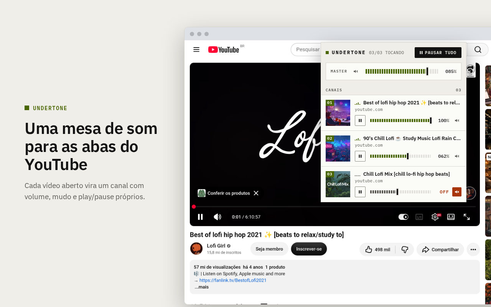
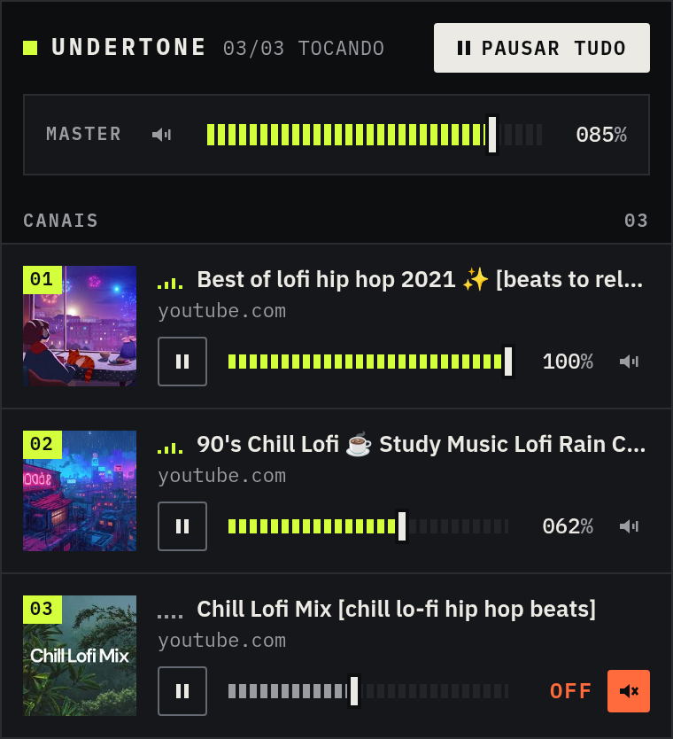
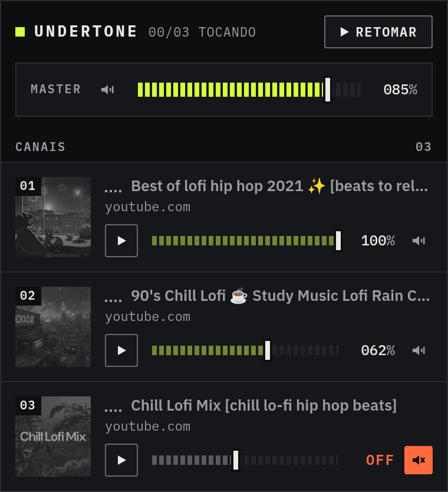
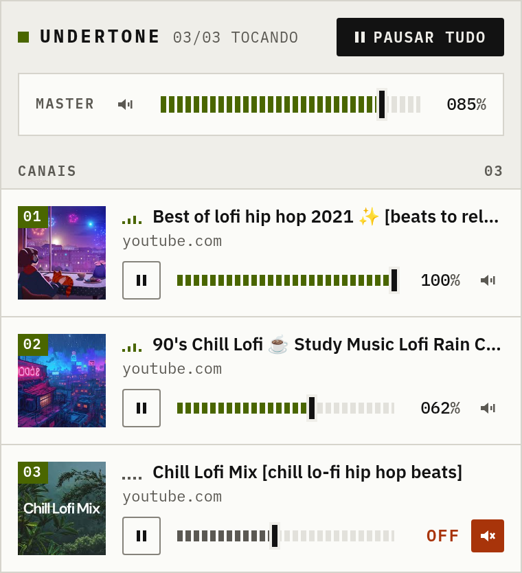
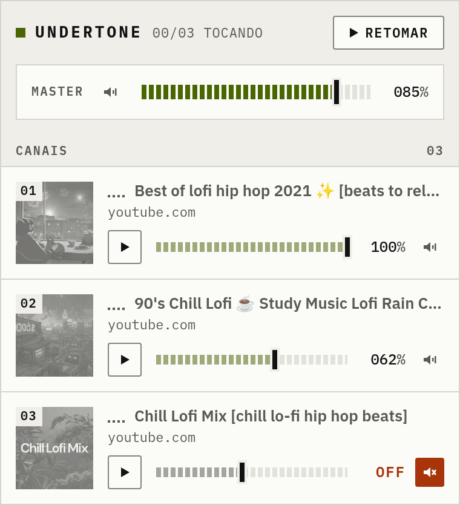
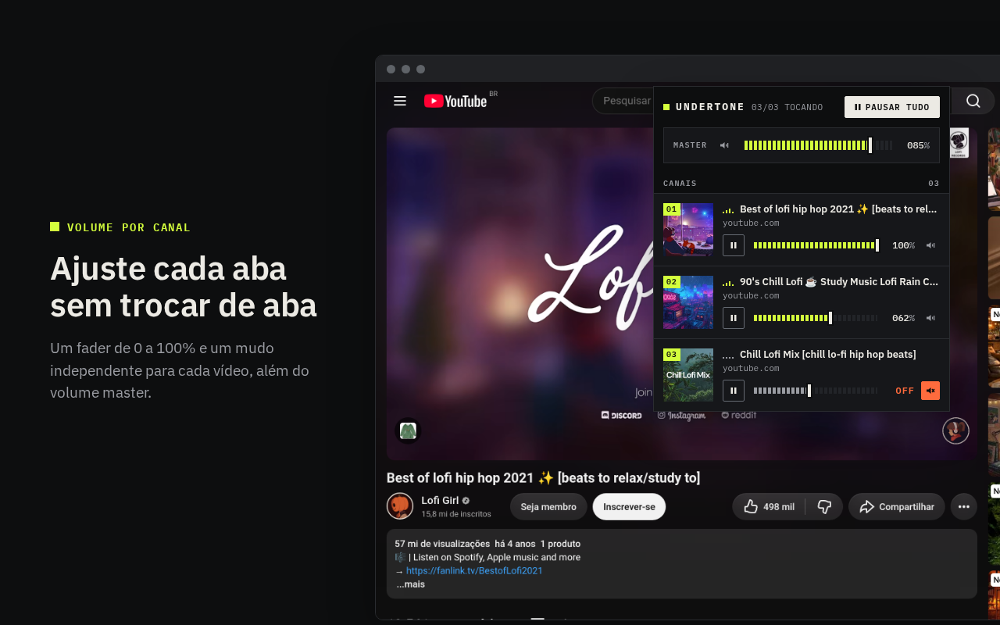
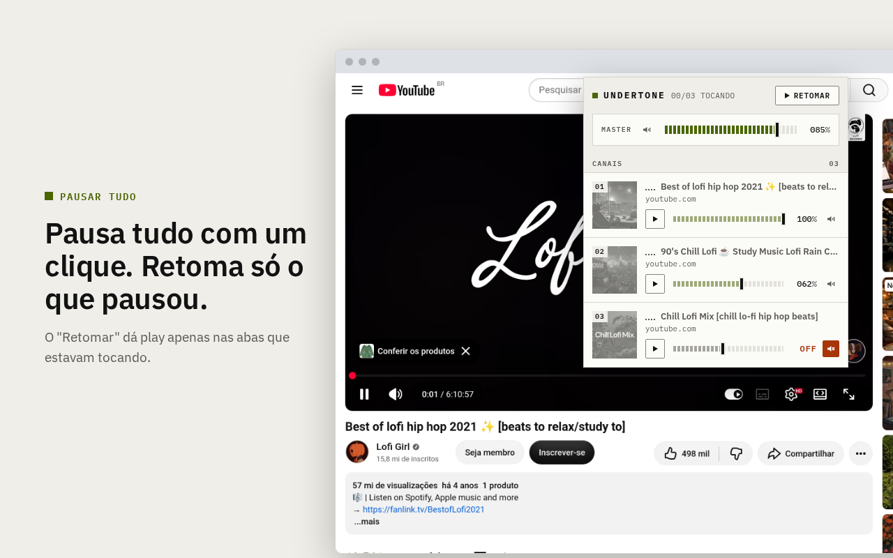
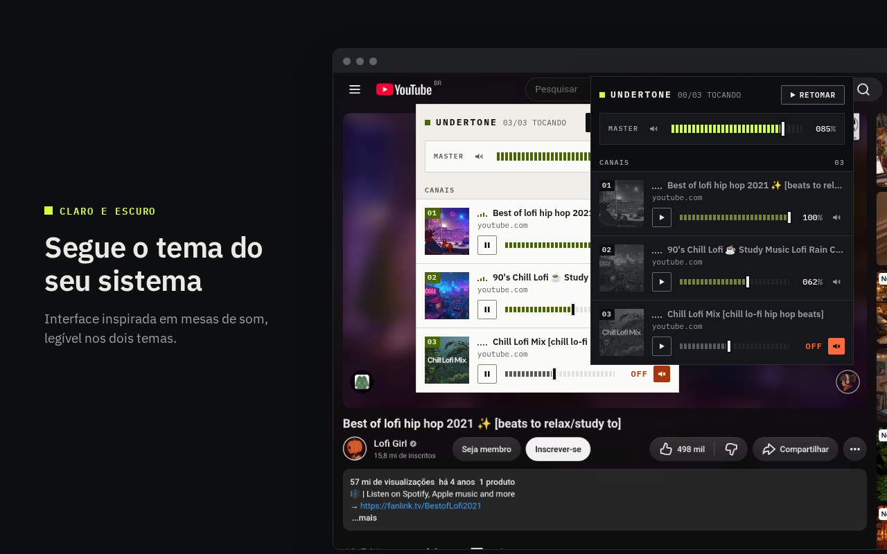

# UnderTone

Uma mesa de som para as abas do navegador. O UnderTone é uma extensão para Firefox e Chrome que lista os vídeos do YouTube abertos e permite controlar cada aba pelo popup: pausar, retomar, silenciar e ajustar o volume. Também há um volume master que vale para todas as abas.



Útil quando você deixa uma playlist de fundo numa aba, uma aula em outra e um vídeo de referência numa terceira: em vez de procurar cada aba para mexer no volume, tudo fica num só lugar, como os canais de uma mesa de som.

## Funcionalidades

- **Um canal por aba:** cada aba de vídeo do YouTube (`/watch` e `/shorts`) aparece como um canal numerado, com miniatura, título e domínio.
- **Volume por canal:** um fader de 0 a 100% e um botão de mudo independente em cada aba.
- **Master:** um volume geral e um mudo geral, aplicados por cima do volume de cada canal.
- **Pausar tudo / Retomar:** pausa todas as abas que estão tocando. Depois, "Retomar" dá play somente nas abas que esse comando pausou.
- **Indicador de atividade:** mostra quais abas estão tocando no momento.
- **Tema claro e escuro:** segue a preferência do sistema.

| Tocando | Pausado |
| --- | --- |
|  |  |
|  |  |

## Como usar

1. Abra um ou mais vídeos do YouTube em abas diferentes.
2. Clique no ícone do UnderTone na barra de ferramentas. Cada vídeo aparece como um canal, na ordem em que foi detectado (`01`, `02`, …). O cabeçalho mostra quantos estão tocando, por exemplo `02/03 TOCANDO`.
3. Em cada canal:
   - **▶ / ❚❚** dá play ou pausa só naquela aba;
   - o **fader** ajusta o volume da aba, de 0 a 100%;
   - o **alto-falante** à direita silencia a aba. O leitor passa a mostrar `OFF`, mas o fader guarda o volume para quando o som voltar.
4. Na faixa **MASTER**, o fader e o mudo valem para todas as abas ao mesmo tempo.
5. **Pausar tudo** pausa o que estiver tocando. O botão vira **Retomar**, que dá play de novo apenas nas abas que foram pausadas por ele. Uma aba que você já tinha pausado antes continua parada.

Não é preciso deixar o popup aberto: os ajustes continuam valendo nas abas depois que ele fecha.

### Como o volume é calculado

O volume que chega ao vídeo é o do canal multiplicado pelo master:

```
volume do vídeo = (canal / 100) × (master / 100)
```

Com o master em 50%, um canal em 80% toca a 40% e um canal em 100% toca a 50%. Assim, o master abaixa tudo na mesma proporção, sem desfazer o equilíbrio entre os canais. O mudo (do canal ou do master) silencia sem alterar nenhum desses números.

Até o popup ver uma aba pela primeira vez, o UnderTone não interfere no volume do player do YouTube. A partir daí, o canal começa no volume que o player tinha naquele momento.

| Volume por canal | Pausar tudo e retomar |
| --- | --- |
|  |  |

## Privacidade e permissões

O UnderTone não coleta nem envia dados. Ele não tem servidor, e o popup não faz requisições de rede além de carregar as miniaturas dos vídeos do `i.ytimg.com`, o mesmo endereço que o YouTube usa. As fontes vêm empacotadas na extensão.

| Permissão | Para quê |
| --- | --- |
| `*://*.youtube.com/*` | Ler o título e o endereço das abas do YouTube e injetar o script que controla o `<video>`. Nenhum outro site é acessado. |
| `storage` | Guardar o volume master e a lista de abas pausadas pelo "Pausar tudo". |

## Requisitos

- Node.js 20 ou mais recente
- Firefox ou um navegador baseado em Chromium

## Como rodar

O código da extensão fica em [`tabmixer/`](tabmixer/).

```bash
cd tabmixer
npm install
```

Desenvolvimento com recarga automática (o comando abre um navegador com a extensão já carregada):

```bash
npm run dev           # Chrome
npm run dev:firefox   # Firefox
```

Build de produção:

```bash
npm run build           # gera .output/chrome-mv3/
npm run build:firefox   # gera .output/firefox-mv2/
npm run zip             # gera o .zip para a Chrome Web Store
npm run zip:firefox     # gera o .zip para o addons.mozilla.org
```

Para carregar o build manualmente:

- **Firefox:** abra `about:debugging#/runtime/this-firefox`, clique em "Carregar extensão temporária" e escolha `tabmixer/.output/firefox-mv2/manifest.json`.
- **Chrome:** abra `chrome://extensions`, ative o "Modo do desenvolvedor", clique em "Carregar sem compactação" e escolha a pasta `tabmixer/.output/chrome-mv3/`.

Depois de um novo build, o navegador continua usando a versão carregada até você recarregar a extensão (botão "Recarregar" em `about:debugging` ou o ícone ↻ em `chrome://extensions`).

Verificação de tipos:

```bash
npm run compile
```

## Como funciona

```
┌──────────── popup (App.tsx) ────────────┐
│ a cada 1 s: tabs.query(abas do YouTube) │
│            → GET_STATE para cada aba    │
│ comandos:  SET_VOLUME / SET_MUTED /     │
│            SET_PAUSED                   │
└───────┬───────────────────────┬─────────┘
        │ tabs.sendMessage      │ storage.local (master)
        ▼                       ▼
┌──── youtube.content.ts (uma por aba) ───┐
│ guarda volume/mudo do canal             │
│ aplica (canal × master) ao <video>      │
└─────────────────────────────────────────┘
```

A cada segundo, o popup consulta as abas do YouTube e pergunta o estado de cada uma ao content script dela. Uma aba só vira canal se responder, ou seja, se tiver um player. Os comandos (volume, mudo, play/pause) vão para a aba como mensagens, e o contrato dessas mensagens fica em [`utils/mixer.ts`](tabmixer/utils/mixer.ts).

O content script ([`youtube.content.ts`](tabmixer/entrypoints/youtube.content.ts)) guarda o volume e o mudo do canal e aplica o volume efetivo ao `<video>`. O master não passa por mensagem: o popup grava em `storage.local`, e cada content script escuta `storage.onChanged` e recalcula o volume. Como o YouTube troca de vídeo sem recarregar a página, o content script também reaplica o volume a cada vídeo novo (`loadedmetadata`).

## Estrutura

```
docs/
  UnderTone-Design-System.pdf     especificação visual do popup
store-assets/                  prints para as lojas e para este README
tabmixer/
  wxt.config.ts                manifest e permissões
  utils/mixer.ts               tipos e mensagens entre o popup e o content script
  entrypoints/
    youtube.content.ts         controla o <video> em cada aba
    popup/
      App.tsx                  estado e integração com o navegador
      components/              Popup, MasterStrip, TrackStrip, Fader, Readout,
                               TransportButton, ActivityMeter, Icon
      styles/                  fonts.css, tokens.css, components.css
```

## Design system

O visual do popup segue o [UnderTone Design System](docs/UnderTone-Design-System.pdf), que define cores (12 tokens em dois temas), tipografia (IBM Plex Sans e Mono), medidas, estados e componentes. `tokens.css` e `components.css` são cópias literais dos apêndices A e B do documento. Ao mudar o visual, atualize o documento primeiro.



As fontes são empacotadas na extensão via `@fontsource`, então o popup não faz requisições de rede para carregá-las.

## Solução de problemas

- **Uma aba de vídeo não aparece no popup.** Se a aba já estava aberta antes de a extensão ser instalada (ou recarregada), ela ainda não tem o content script. Recarregue a aba.
- **O popup diz "Nenhuma aba tocando áudio agora".** Só páginas de vídeo (`/watch` e `/shorts`) contam. A página inicial, a busca e os canais do YouTube não aparecem.
- **O volume mudou sozinho ao trocar de vídeo.** O player do YouTube reaplica o próprio volume ao carregar um vídeo, e o UnderTone sobrescreve logo em seguida. Se você mexer no volume pelo player do YouTube, o próximo vídeo volta ao valor do canal.

## Stack

[WXT](https://wxt.dev), React 19, TypeScript e CSS com custom properties.

## Limitações atuais

- Só abas de vídeo do YouTube são listadas. Para incluir outros sites, seria preciso pedir permissão para todos os sites (`<all_urls>`) e generalizar o content script.
- O volume de cada canal fica guardado só enquanto a aba está aberta; o volume master é o único salvo em `storage.local`.
- Mudanças feitas direto no player do YouTube não aparecem no fader do canal.
